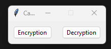
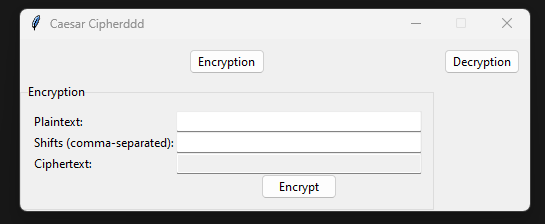
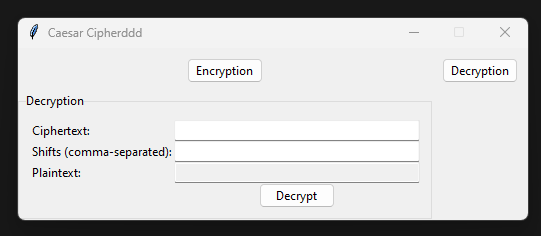

# Caesar Cipher Application

## Video URL

[Project Demonstration Video](https://youtu.be/twvDWFsVkFo)

A simple and interactive Caesar Cipher application implemented in Python with Tkinter.

## Project Overview

The Caesar Cipher application is a desktop-based tool designed for encrypting and decrypting text using the Caesar Cipher technique. This application offers a user-friendly graphical interface, built with Tkinter, that allows users to interactively encrypt and decrypt text.

- **Simple and Intuitive** : The application boasts a straightforward layout, making it easy for users of all levels to understand and use. With clearly labeled sections for both encryption and decryption, users can effortlessly navigate through the application.

- **Real-Time Interaction**: Users can see the results of their encryption or decryption actions in real-time. This immediate feedback enhances the learning and user experience, especially for those new to the concept of the Caesar Cipher.

- **Educational Tool**: Beyond its practical use, the application serves as an excellent educational resource for understanding the basics of cryptography. It visually demonstrates how text can be encrypted and decrypted, making it a valuable tool for students and enthusiasts alike.

### Technical Aspects

- **Tkinter for GUI**: The application uses Tkinter, a standard GUI toolkit in Python, which is known for its simplicity and effectiveness in creating desktop applications. Tkinter's versatility allows for the creation of a responsive and accessible user interface.

- **Customizability**: Users have the freedom to specify their shift values, offering a level of customization that adds depth to the encryption and decryption process. This feature allows for a more robust exploration of the Caesar Cipher technique.

- **Robust Error Handling**: The application includes error handling mechanisms to manage user input errors gracefully. These checks ensure that the application remains stable and user-friendly, even when faced with unexpected or incorrect inputs.

### Ideal Use Cases

- **Educational Environments**: Perfect for classroom settings or self-learning, the application can be used to teach the fundamentals of encryption and cryptography.
- **Personal Encryption Needs**: Individuals can use this tool for simple encryption tasks, such as creating coded messages for fun or for basic privacy needs.

In summary, the Caesar Cipher application is a blend of educational value and practical utility, packaged in a sleek, easy-to-use interface. It stands as a testament to how classic cryptographic techniques can be brought to life through modern programming.

### Key Features

- **Encryption and Decryption**: Users can input text and apply the Caesar Cipher encryption algorithm by specifying a series of shifts. The application also supports decrypting ciphertext using the same method.
- **Interactive GUI**: Features separate frames for encryption and decryption, equipped with text entry fields and operational buttons.
- **Custom Shift Values**: Flexibility to specify custom shift values, enhancing versatility.
- **Error Handling**: Includes robust error handling for invalid inputs.

## Detailed Technical Breakdown

- `main()`:
  - **Purpose**: Serves as the starting point of the application, initializing the main application window using Tkinter. This function creates the GUI layout, including frames for encryption and decryption, input fields, and buttons.
  - **Usage**: Called when `project.py` is executed. It sets up the GUI elements like text entry fields, buttons, and labels, and organizes them into encryption and decryption sections. It also initializes global variables and sets the title and other properties of the main window.

- `caesar_cipher(text, shifts, decrypt)`:
  - **Purpose**: The fundamental function that implements the Caesar Cipher algorithm. It performs character-wise shifting of the input text based on the provided shifts. It can encrypt by shifting characters forward or decrypt by shifting characters backward, depending on the decrypt flag.
  - **Usage**: This function is called whenever the user presses the Encrypt or Decrypt button. The input text and shifts are passed to this function, which then returns the transformed text.

- `get_shifts(shift_str)`:
  - **Purpose**: Parses the shift values provided by the user. It converts a string of comma-separated numbers into a list of integers. This function is crucial for dynamically handling the shift values in the Caesar Cipher.
  - **Usage**: Invoked when the user inputs shift values in the encryption or decryption frame. It ensures that the shift values are in the correct format (a list of integers) before they are used in the caesar_cipher function.

- `encrypt_text()`:
  - **Purpose**: Handles the process of encryption. It retrieves the plaintext and shift values from the GUI, calls caesar_cipher with these values for encryption, and displays the encrypted text in the GUI.
  - **Usage**: Bound to the 'Encrypt' button in the GUI. When the button is clicked, this function is triggered, performing the encryption process and updating the GUI with the result.

- `decrypt_text()`:
  - **Purpose**: Complements encrypt_text by handling decryption. It takes the ciphertext and shift values from the user, calls caesar_cipher for decryption, and displays the plaintext in the GUI.
  - **Usage**: Linked to the 'Decrypt' button in the GUI. Clicking this button activates the function, which then processes the input ciphertext and updates the GUI with the decrypted text.

These functions work together to provide a seamless and user-friendly experience in the Caesar Cipher application, making it easy for users to encrypt and decrypt text as needed.

## File Structure

- `project.py`: The main application file containing the Tkinter GUI setup, entry points for the application, and integration of all components.
- `test_project.py`: Contains pytest test cases for the various functions used in the application, ensuring reliability and correctness.
- `requirements.txt`: All pip-installable libraries that my project requires.

## How to Use

1. **Launch the Application**: Run `project.py` to start the application.
2. **Choose Operation**: Select either the Encryption or Decryption tab.
3. **Enter Text and Shifts**: Input plaintext for encryption or ciphertext for decryption, along with comma-separated shift values.
4. **Perform Operation**: Click on the Encrypt/Decrypt button to process the text.
5. **View Results**: See the encrypted or decrypted text in the output field.

## Application Screenshots

### Main Screen

### Encryption Screen

### Decryption Screen

## Installation

Clone the repository or download the source code. Ensure Python is installed on your system. Tkinter is included in Python's standard library, so no additional installation is required.

## Dependencies

- Python (3.x recommended)
- Tkinter (included in Python's standard library)
